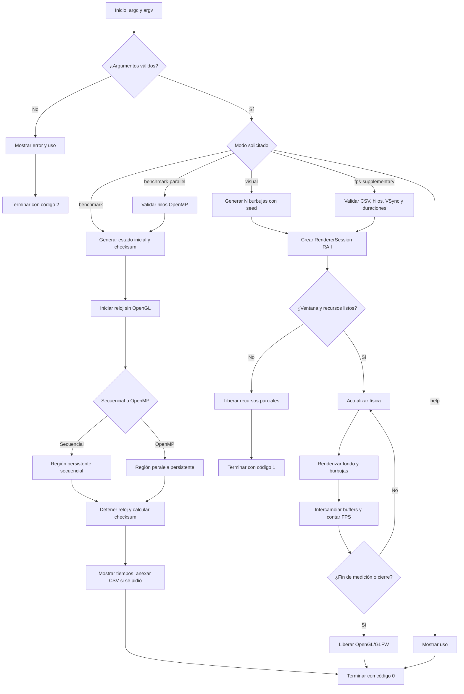
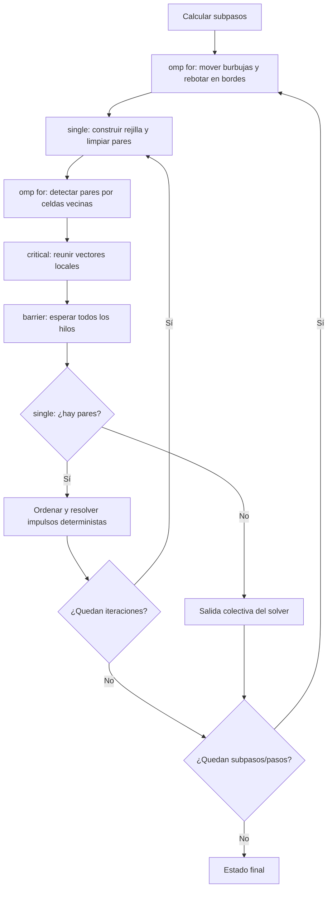

# Anexo 1 — Diagrama de flujo

El programa no solicita datos de manera interactiva: recibe `N` y los demás
parámetros por línea de comandos. Si falta un dato obligatorio o un valor no
cumple los límites, muestra el error, imprime el uso y termina sin crear la
ventana ni modificar un CSV.

## Paso de física y sincronización

La sección `critical` protege el vector compartido de pares. La barrera
explícita impide que `single` consuma listas incompletas; la barrera implícita
al terminar `single` hace que todos los hilos observen `collisionPairsFound`
antes de decidir la salida. La resolución se serializa deliberadamente para
evitar escrituras concurrentes sobre una misma burbuja y conservar un orden
determinista idéntico al secuencial.
